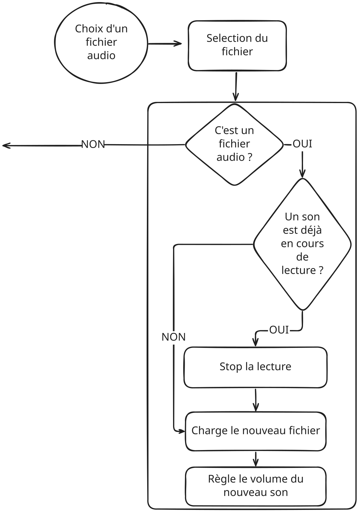

# Guide étape par étape : Ajouter la personnalisation à votre table de mixage DJ

Ce guide vous accompagne dans l'ajout de fonctionnalités de téléchargement de fichiers à votre table de mixage DJ. Vous apprendrez comment permettre aux utilisateurs de télécharger leurs propres images de fond et sons !

---

## Introduction : Comprendre la personnalisation

### Ce que nous ajoutons

Nous allons ajouter des fonctionnalités de personnalisation qui permettent aux utilisateurs de :
- Télécharger leurs propres images de fond
- Télécharger leurs propres sons pour chaque piste
- Personnaliser leur expérience de table de mixage DJ


### Concepts clés

**Téléchargements de fichiers** : Les téléchargements de fichiers permettent aux utilisateurs de sélectionner des fichiers depuis leur ordinateur et de les utiliser dans votre programme. C'est ainsi que les sites web vous permettent de télécharger des photos, des documents, ou dans notre cas, des sons et des images.

**Éléments File Input** : Ce sont des éléments HTML qui créent un bouton "Choisir un fichier". Quand on clique dessus, ils ouvrent un navigateur de fichiers pour que les utilisateurs puissent sélectionner des fichiers.

**Gestion des fichiers** : Une fois qu'un fichier est sélectionné, vous devez le charger et l'utiliser dans votre programme. Différents types de fichiers (images vs. sons) nécessitent une gestion différente.

---

## Étape 1 : Comprendre les téléchargements de fichiers

### Qu'est-ce qu'un téléchargement de fichier ?

Les téléchargements de fichiers sont un moyen pour les utilisateurs de sélectionner des fichiers depuis leur ordinateur et de les utiliser dans votre application web. Dans p5.js, vous utilisez `createFileInput()` pour que cela se produise.

**Comment ça fonctionne** :
1. Vous créez un bouton de saisie de fichier
2. L'utilisateur clique sur le bouton
3. Un navigateur de fichiers s'ouvre
4. L'utilisateur sélectionne un fichier
5. Votre programme reçoit des informations sur le fichier
6. Vous pouvez ensuite charger et utiliser ce fichier


### Types de fichiers

Différents fichiers ont différents types :
- **Images** : JPG, PNG, GIF, etc.
- **Audio** : MP3, WAV, OGG, etc.

Vous pouvez restreindre les file inputs pour n'accepter que certains types en utilisant l'attribut `accept`.

---

## Étape 2 : Ajouter le téléchargement d'image de fond

### Étape 2 (A) : Créer une variable pour l'image de fond

D'abord, vous avez besoin d'un endroit pour stocker l'image téléchargée. En haut de votre code (avant les objets track), ajoutez :

```javascript
let bgImage = null;
```

**Comprendre le code** :
- `let bgImage` crée une variable pour stocker l'image
- `= null` signifie "pas d'image encore" - nous la définirons quand un utilisateur télécharge une image
- `null` est une valeur spéciale qui signifie "rien" ou "vide"

**Pourquoi `null` ?** C'est une façon de dire "nous n'avons pas encore d'image, mais nous en aurons plus tard." C'est utile pour vérifier si une image a été téléchargée.

### Étape 2 (B) : Créer le bouton de saisie de fichier

Dans votre fonction `setup()`, après avoir créé le canvas, ajoutez :

```javascript
// Create file input for background image
let bgFileInput = createFileInput(handleBackgroundImage);
bgFileInput.position(10, 10);
bgFileInput.attribute('accept', 'image/*');
```

**Comprendre le code** :
- [`createFileInput(handleBackgroundImage)`](https://p5js.org/reference/p5/createFileInput) crée un bouton de téléchargement de fichier
  - `handleBackgroundImage` est le nom de la fonction qui s'exécutera quand un fichier est sélectionné
- [`position(10, 10)`](https://p5js.org/reference/p5.Element/position) place le bouton aux coordonnées (10, 10) - en haut à gauche
- [`attribute('accept', 'image/*')`](https://p5js.org/reference/p5.Element/attribute) restreint la sélection de fichiers aux images uniquement
  - `'image/*'` signifie "n'importe quel type d'image" (JPG, PNG, GIF, etc.)


**Testez !** Vous devriez voir un bouton "Choisir un fichier" en haut à gauche. Essayez de cliquer dessus - un navigateur de fichiers devrait s'ouvrir, mais il ne fera rien encore car nous n'avons pas créé la fonction de gestion.

### Étape 2 (C) : Créer la fonction de gestion

Quand un utilisateur sélectionne un fichier image, vous avez besoin d'une fonction pour le gérer. Créez cette fonction :

```javascript
function handleBackgroundImage(file) {
    if (file.type === 'image') {
        bgImage = loadImage(file.data);
    }
}
```

**Comprendre le code** :
- `function handleBackgroundImage(file)` - cette fonction s'exécute quand un fichier est sélectionné
  - `file` est un objet contenant des informations sur le fichier sélectionné
- `if (file.type === 'image')` - vérifiez si le fichier est une image
  - `file.type` vous indique quel type de fichier c'est
- `bgImage = loadImage(file.data)` - chargez l'image depuis le fichier
  - [`loadImage()`](https://p5js.org/reference/p5/loadImage) charge un fichier image
  - `file.data` contient les données du fichier que p5.js peut utiliser

**Pourquoi vérifier le type de fichier ?** Les utilisateurs pourraient accidentellement sélectionner le mauvais type de fichier. Cette vérification empêche les erreurs.


**Testez !** Essayez de télécharger une image - le fichier devrait être sélectionné, mais vous ne le verrez pas encore (nous l'ajouterons ensuite).

### Étape 2 (D) : Afficher l'image de fond

Maintenant, vous devez afficher l'image téléchargée comme fond. Dans votre fonction `draw()`, au tout début, remplacez `background(255);` par :

```javascript
// Draw background image if loaded, otherwise white background
if (bgImage) {
    image(bgImage, 0, 0, width, height);
} else {
    background(255);
}
```

**Comprendre le code** :
- `if (bgImage)` - vérifiez si une image a été téléchargée
  - Si `bgImage` n'est pas `null`, cette condition est vraie
- `image(bgImage, 0, 0, width, height)` - dessinez l'image
  - [`image()`](https://p5js.org/reference/p5/image) dessine une image
  - `bgImage` est l'image à dessiner
  - `0, 0` est la position (coin supérieur gauche)
  - `width, height` la fait remplir tout le canvas
- `else { background(255); }` - si pas d'image, utilisez le fond blanc
  - C'est le fond par défaut


**Testez !** Téléchargez une image - elle devrait maintenant apparaître comme fond, remplissant tout le canvas !

---

## Étape 3 : Ajouter le téléchargement de son pour la piste 1

### Étape 3 (A) : Ajouter la propriété File Input aux objets Track

Chaque piste doit stocker son bouton de saisie de fichier. Dans les objets `track1` et `track2`, ajoutez :

```javascript
fileInput: null
```

Donc vos objets track devraient ressembler à :

```javascript
let track1 = {
    sound: null,
    volume: 0.5,
    isPlaying: false,
    slider: null,
    sliderPosition: {
        x: 150,
        y: 350
    },
    button: null,
    buttonPosition: {
        x: 150,
        y: 200
    },
    buttonLabel: "Track 1",
    fileInput: null  // Add this
};
```

**Comprendre le code** :
- `fileInput: null` - nous stockerons le bouton de saisie de fichier ici plus tard
- Tout comme `slider: null` et `button: null`, cela stocke un élément UI

### Étape 3 (B) : Créer le bouton de saisie de fichier pour la piste 1

Dans votre fonction `setup()`, après avoir créé le file input de l'image de fond, ajoutez :

```javascript
// Create file input for track 1 sound
track1.fileInput = createFileInput(function(file) {
    handleSoundUpload(file, track1);
});
track1.fileInput.position(10, 50);
track1.fileInput.attribute('accept', 'audio/*');
```

**Comprendre le code** :
- `track1.fileInput = createFileInput(...)` - créez le file input et stockez-le dans l'objet track
- `function(file) { handleSoundUpload(file, track1); }` - quand un fichier est sélectionné :
  - Cette fonction anonyme s'exécute
  - Elle appelle `handleSoundUpload()` avec le fichier et l'objet track
  - Nous passons `track1` pour que la fonction sache quelle piste mettre à jour
- `position(10, 50)` - placez-le sous le bouton de téléchargement de fond (50 pixels vers le bas)
- `attribute('accept', 'audio/*')` - restreignez aux fichiers audio uniquement

**Pourquoi passer l'objet track ?** Pour que la fonction de gestion sache quelle piste mettre à jour. Cela nous permet d'utiliser le même gestionnaire pour les deux pistes !


**Testez !** Vous devriez voir un deuxième bouton "Choisir un fichier" sous le premier. Il ne fonctionnera pas encore car nous n'avons pas créé la fonction de gestion.

### Étape 3 (C) : Créer le gestionnaire de téléchargement de son

Créez une fonction pour gérer les téléchargements de sons :

```javascript
function handleSoundUpload(file, track) {
    if (file.type === 'audio') {
        // Stop current sound if playing
        if (track.sound && track.sound.isPlaying()) {
            track.sound.stop();
            track.isPlaying = false;
            track.button.html(track.buttonLabel + " ▶");
        }
        
        // Load new sound
        track.sound = loadSound(file.data);
        track.sound.setVolume(track.volume);
    }
}
```

**Comprendre le code** :
- `function handleSoundUpload(file, track)` - prend le fichier et l'objet track
- `if (file.type === 'audio')` - vérifiez si c'est un fichier audio
- `if (track.sound && track.sound.isPlaying())` - s'il y a un son actuel et qu'il est en lecture :
  - `track.sound.stop()` - arrêtez le son actuel
  - `track.isPlaying = false` - mettez à jour l'état de lecture
  - `track.button.html(track.buttonLabel + " ▶")` - réinitialisez le label du bouton
- `track.sound = loadSound(file.data)` - chargez le nouveau son
  - [`loadSound()`](https://p5js.org/reference/p5.sound/p5.SoundFile) charge les fichiers son
  - `file.data` contient les données du fichier
- `track.sound.setVolume(track.volume)` - définissez le volume pour qu'il soit prêt à jouer

**Pourquoi arrêter le son actuel ?** Si un son est en lecture quand un nouveau est téléchargé, nous devrions l'arrêter d'abord. Sinon, les deux sons pourraient jouer en même temps, ou l'ancien son pourrait continuer à jouer.

**Concept visuel** : 

**Testez !** Téléchargez un fichier audio pour la piste 1 - il devrait remplacer le son par défaut ! Essayez de le jouer pour vous assurer que cela fonctionne.

---

## Étape 4 : Ajouter le téléchargement de son pour la piste 2

### Répéter le processus

La piste 2 a besoin de la même fonctionnalité. Dans votre fonction `setup()`, après avoir créé le file input de la piste 1, ajoutez :

```javascript
// Create file input for track 2 sound
track2.fileInput = createFileInput(function(file) {
    handleSoundUpload(file, track2);
});
track2.fileInput.position(10, 90);
track2.fileInput.attribute('accept', 'audio/*');
```

**Comprendre le code** :
- Même chose que la piste 1, mais pour `track2`
- Position à `(10, 90)` - sous le file input de la piste 1
- Utilise la même fonction `handleSoundUpload()` - c'est la réutilisation de code !

**Pourquoi le même gestionnaire ?** Parce que nous passons l'objet track comme paramètre, la même fonction fonctionne pour les deux pistes. C'est plus efficace que d'écrire le même code deux fois.


**Testez !** Téléchargez des fichiers audio pour les deux pistes - ils devraient tous les deux fonctionner indépendamment !

---

## Étape 5 : Améliorer l'expérience utilisateur

### Ajouter des labels

Les utilisateurs doivent savoir ce que fait chaque bouton de saisie de fichier. Dans votre fonction `draw()`, ajoutez des labels :

```javascript
// Draw upload labels
fill(0);
textAlign(LEFT);
text("Upload Background:", 10, 35);
text("Upload Track 1:", 10, 75);
text("Upload Track 2:", 10, 115);
```

**Comprendre le code** :
- `fill(0)` - couleur de texte noire
- `textAlign(LEFT)` - alignez le texte à gauche
- `text("Upload Background:", 10, 35)` - dessinez le label à la position (10, 35)
  - Positionné juste au-dessus du bouton de saisie de fichier de fond
- Même chose pour les labels de la piste 1 et de la piste 2


**Testez !** Les labels devraient rendre clair ce que fait chaque bouton !

### Gérer les cas limites

Assurez-vous que votre code gère les situations où les choses pourraient mal tourner. Mettez à jour votre fonction `toggleTrack()` :

```javascript
function toggleTrack(track) {
    // Check if sound is loaded
    if (!track.sound) {
        return;
    }
    
    // ... rest of the function
}
```

**Comprendre le code** :
- `if (!track.sound)` - s'il n'y a pas de son chargé
- `return;` - quittez la fonction tôt (n'essayez pas de jouer)
- Cela empêche les erreurs si un utilisateur clique sur play avant de télécharger un son

Mettez aussi à jour votre fonction `draw()` pour vérifier si les sons existent :

```javascript
// Apply volume to playing sounds
if (track1.sound && track1.sound.isPlaying()) {
    track1.sound.setVolume(track1.volume);
}
if (track2.sound && track2.sound.isPlaying()) {
    track2.sound.setVolume(track2.volume);
}
```

**Comprendre le code** :
- `if (track1.sound && ...)` - vérifiez si le son existe ET est en lecture
- L'opérateur `&&` signifie "les deux conditions doivent être vraies"
- Cela empêche les erreurs si un son n'a pas encore été téléchargé

**Pourquoi gérer les cas limites ?** Les utilisateurs pourraient faire des choses inattendues (comme cliquer sur play avant de télécharger un son). Votre programme devrait gérer cela gracieusement au lieu de planter.

**Testez !** Essayez de cliquer sur les boutons play avant de télécharger des sons - le programme devrait le gérer gracieusement sans erreurs !

---

## Étape 6 : Tout mettre ensemble

### Liste de contrôle des tests finaux

Testez toutes les fonctionnalités :

1. ✅ **Téléchargement d'image de fond**
   - Cliquez sur "Choisir un fichier" pour le fond
   - Sélectionnez une image
   - Apparaît-elle comme fond ?

2. ✅ **Téléchargement de son pour la piste 1**
   - Cliquez sur "Choisir un fichier" pour la piste 1
   - Sélectionnez un fichier audio
   - Remplace-t-il le son par défaut ?
   - Pouvez-vous le jouer ?

3. ✅ **Téléchargement de son pour la piste 2**
   - Cliquez sur "Choisir un fichier" pour la piste 2
   - Sélectionnez un fichier audio
   - Remplace-t-il le son par défaut ?
   - Pouvez-vous le jouer ?

4. ✅ **Mixage**
   - Téléchargez des sons pour les deux pistes
   - Jouez les deux pistes en même temps
   - Ajustez les volumes indépendamment
   - Tout fonctionne-t-il ensemble ?

5. ✅ **Cas limites**
   - Essayez de cliquer sur play avant de télécharger des sons
   - Essayez de télécharger de mauvais types de fichiers
   - Le programme gère-t-il cela gracieusement ?

### Idées de personnalisation

Maintenant que les téléchargements de fichiers fonctionnent, essayez :
- Téléchargez différentes images de fond (photos, motifs, couleurs)
- Téléchargez vos chansons préférées
- Mélangez différents genres de musique
- Créez des tables de mixage DJ thématiques :
  - Musique électronique avec des fonds néon
  - Jazz avec des fonds photo vintage
  - Rock avec des fonds photo de concert

---

## Dépannage

### Problème : L'image ne s'affiche pas après le téléchargement

**Causes possibles** :
- L'image n'est pas chargée correctement
- L'image n'est pas dessinée dans `draw()`

**Solutions** :
- Vérifiez que `handleBackgroundImage()` appelle `loadImage(file.data)`
- Vérifiez que `draw()` vérifie `if (bgImage)` et appelle `image()`
- Vérifiez la console du navigateur pour les messages d'erreur

### Problème : Le son ne joue pas après le téléchargement

**Causes possibles** :
- Le son n'est pas chargé correctement
- Le son n'est pas configuré correctement

**Solutions** :
- Vérifiez que `handleSoundUpload()` appelle `loadSound(file.data)`
- Vérifiez que le volume est défini : `track.sound.setVolume(track.volume)`
- Vérifiez la console du navigateur pour les messages d'erreur
- Assurez-vous que vous utilisez des fichiers audio (MP3, WAV, OGG)

### Problème : Les boutons de saisie de fichier sont au mauvais endroit

**Solution** : Ajustez les valeurs `position()` :
- `position(10, 10)` - téléchargement d'image de fond
- `position(10, 50)` - téléchargement de la piste 1
- `position(10, 90)` - téléchargement de la piste 2
- Augmentez les valeurs y pour les déplacer vers le bas

### Problème : De mauvais types de fichiers peuvent être sélectionnés

**Solution** : Vérifiez que vous utilisez `.attribute('accept', 'image/*')` pour les images et `'audio/*'` pour les fichiers audio.

### Problème : Le programme plante quand on clique sur play avant de télécharger

**Solution** : Assurez-vous que vous vérifiez si les sons existent :
- Dans `toggleTrack()` : `if (!track.sound) { return; }`
- Dans `draw()` : `if (track1.sound && track1.sound.isPlaying())`

### Problème : Les boutons ne fonctionnent pas sur mobile

**Causes possibles** :
- Gestionnaires d'événements tactiles manquants
- Événements tactiles pas correctement configurés

**Solutions** :
- Assurez-vous que vous avez ajouté les gestionnaires `.touchStarted()` à vos boutons
- Vérifiez que `mousePressed()` et `touchStarted()` sont tous les deux configurés

### Problème : La mise en page semble incorrecte sur mobile

**Causes possibles** :
- Taille de canvas fixe au lieu de responsive
- Positions codées en dur au lieu de calculées

**Solutions** :
- Utilisez `createCanvas(windowWidth, windowHeight)` au lieu d'une taille fixe
- Créez une fonction `updatePositions()` qui calcule les positions en fonction de la taille de l'écran
- Utilisez des pourcentages (comme `width * 0.3`) au lieu de pixels fixes

### Problème : Les éléments ne bougent pas quand l'écran tourne

**Causes possibles** :
- Fonction `windowResized()` manquante
- Positions non mises à jour lors du redimensionnement

**Solutions** :
- Créez une fonction `windowResized()` qui :
  - Appelle `resizeCanvas(windowWidth, windowHeight)`
  - Appelle `updatePositions()`
  - Met à jour les positions des boutons et sliders

**Rappelez-vous** : Vérifiez toujours la console du navigateur (F12) pour les messages d'erreur. Ils vous diront exactement ce qui ne va pas !

---

## Étape 7 : Rendre compatible mobile

### Comprendre le support mobile

Votre table de mixage DJ devrait fonctionner sur les appareils mobiles ! Cela signifie supporter les interactions tactiles et s'adapter à différentes tailles d'écran.

### Étape 7 (A) : Rendre le canvas responsive

Au lieu d'une taille de canvas fixe, utilisez la taille complète de la fenêtre :

```javascript
function setup() {
    // Use full screen size for mobile responsiveness
    createCanvas(windowWidth, windowHeight);
    
    // ... rest of setup code
}
```

**Comprendre le code** :
- [`windowWidth`](https://p5js.org/reference/p5/windowWidth) et [`windowHeight`](https://p5js.org/reference/p5/windowHeight) sont des variables p5.js qui vous donnent la taille de la fenêtre du navigateur
- Cela fait que votre canvas remplit tout l'écran sur n'importe quel appareil

### Étape 7 (B) : Rendre les positions responsive

Créez une fonction pour calculer les positions en fonction de la taille de l'écran :

```javascript
function updatePositions() {
    // Calculate responsive positions based on screen size
    let centerX = width / 2;
    let buttonY = height * 0.3;
    let sliderY = height * 0.6;
    
    // Track 1 on left side
    track1.buttonPosition.x = centerX - width * 0.2;
    track1.buttonPosition.y = buttonY;
    track1.sliderPosition.x = centerX - width * 0.2;
    track1.sliderPosition.y = sliderY;
    
    // Track 2 on right side
    track2.buttonPosition.x = centerX + width * 0.2;
    track2.buttonPosition.y = buttonY;
    track2.sliderPosition.x = centerX + width * 0.2;
    track2.sliderPosition.y = sliderY;
}
```

**Comprendre le code** :
- Utilise des pourcentages (`height * 0.3`) au lieu de pixels fixes
- Calcule les positions en fonction de la taille actuelle du canvas
- Fonctionne sur n'importe quelle taille d'écran

Appelez cette fonction dans `setup()` après avoir créé le canvas.

### Étape 7 (C) : Ajouter le support tactile

Ajoutez des gestionnaires d'événements tactiles à vos boutons :

```javascript
// Create play button for track 1
track1.button = createButton(track1.buttonLabel + " ▶");
track1.button.position(track1.buttonPosition.x, track1.buttonPosition.y);
track1.button.mousePressed(function() {
    toggleTrack(track1);
});
track1.button.touchStarted(function() {
    toggleTrack(track1);
});
```

**Comprendre le code** :
- [`.touchStarted()`](https://p5js.org/reference/p5.Element/touchStarted) gère les événements tactiles sur les appareils mobiles
- Fonctionne de la même manière que `.mousePressed()` mais pour les écrans tactiles

### Étape 7 (D) : Gérer le redimensionnement de la fenêtre

Créez une fonction pour gérer les changements de taille de fenêtre :

```javascript
function windowResized() {
    // Resize canvas when window size changes
    resizeCanvas(windowWidth, windowHeight);
    updatePositions();
    
    // Update button and slider positions
    track1.button.position(track1.buttonPosition.x, track1.buttonPosition.y);
    track2.button.position(track2.buttonPosition.x, track2.buttonPosition.y);
    track1.slider.position(track1.sliderPosition.x, track1.sliderPosition.y);
    track2.slider.position(track2.sliderPosition.x, track2.sliderPosition.y);
}
```

**Comprendre le code** :
- [`windowResized()`](https://p5js.org/reference/p5/windowResized) s'exécute automatiquement quand la taille de la fenêtre change
- Met à jour la taille du canvas et recalcule toutes les positions
- Garde tout positionné correctement après rotation ou redimensionnement

### Étape 7 (E) : Rendre le texte responsive

Mettez à jour les tailles de texte pour qu'elles soient responsive :

```javascript
function draw() {
    // ... background code ...
    
    // Draw title with responsive text size
    fill(0);
    textAlign(CENTER);
    textSize(min(width, height) * 0.04);
    text("DJ Mixing Deck", width/2, height * 0.1);
    
    // ... rest of draw code ...
}
```

**Comprendre le code** :
- `textSize(min(width, height) * 0.04)` rend la taille du texte proportionnelle à la taille de l'écran
- `min(width, height)` utilise la plus petite dimension pour que le texte ne devienne pas trop grand sur les écrans larges

---

## Étape 8 : Partager votre table de mixage DJ

### Partager sur l'éditeur web p5.js

Une fois que votre table de mixage DJ fonctionne, vous pouvez la partager avec d'autres :

1. Dans l'éditeur web p5.js, cliquez sur le bouton "Share" (généralement en haut à droite)
2. Copiez le lien de partage qui apparaît
3. Envoyez-le à des amis ou publiez-le en ligne

**Pourquoi partager ?**
- Les amis peuvent utiliser votre table de mixage DJ
- Ils peuvent télécharger leurs propres sons et images
- Vous pouvez obtenir des commentaires et voir comment d'autres l'utilisent
- Construisez une communauté autour de votre projet

### Tester sur mobile

**Important** : Testez toujours votre sketch sur un appareil mobile !

1. Ouvrez le lien de partage sur votre téléphone ou tablette
2. Testez toutes les fonctionnalités :
   - ✅ Pouvez-vous appuyer sur les boutons pour play/pause ?
   - ✅ Pouvez-vous faire glisser les sliders pour ajuster le volume ?
   - ✅ Pouvez-vous télécharger des images et des sons ?
   - ✅ Tout fonctionne-t-il quand vous tournez l'écran ?
   - ✅ Les boutons et sliders sont-ils faciles à appuyer sur un petit écran ?

**Pourquoi tester sur mobile ?**
- Les appareils mobiles sont la façon dont la plupart des gens accèdent au web
- Les interactions tactiles sont différentes des clics de souris
- Les tailles d'écran varient, donc vous devez vous assurer que cela fonctionne partout
- Vous pourriez découvrir des problèmes que vous n'avez pas vus sur desktop

### Partager avec des amis

**Votre tâche** :
1. Partagez votre lien de sketch p5.js avec un ami
2. Demandez-leur de :
   - L'ouvrir sur leur téléphone
   - Télécharger leurs propres sons et images
   - Créer leur propre table de mixage DJ personnalisée
   - Le partager avec vous !

**Pourquoi partager ?**
- Voyez comment d'autres personnalisent votre création
- Obtenez des idées d'améliorations
- Construisez une communauté autour de votre projet
- Amusez-vous à mélanger de la musique ensemble !
- Apprenez de la façon dont d'autres utilisent votre code

---

## Félicitations ! 🎉

Vous avez ajouté avec succès des fonctionnalités de personnalisation à votre table de mixage DJ ! Les utilisateurs peuvent maintenant télécharger leurs propres images de fond et sons, rendant chaque table de mixage DJ unique et personnelle.

**Ce que vous avez appris** :
- Comment fonctionnent les téléchargements de fichiers dans les applications web
- Comment créer des boutons de saisie de fichier dans p5.js
- Comment gérer les téléchargements de fichiers image
- Comment gérer les téléchargements de fichiers audio
- Comment remplacer les assets existants par des fichiers téléchargés par l'utilisateur
- Comment améliorer l'expérience utilisateur avec des labels et la gestion des erreurs
- Comment gérer les cas limites gracieusement
- Comment rendre votre sketch compatible mobile avec un design responsive
- Comment ajouter le support tactile pour les appareils mobiles
- Comment gérer le redimensionnement de fenêtre et la rotation d'écran
- Comment partager votre création avec d'autres

**Prochaines étapes** :
- Expérimentez avec différents types de fichiers
- Ajoutez plus d'options de personnalisation (couleurs, polices, etc.)
- **Partagez votre lien de sketch p5.js avec des amis !**
- **Testez-le sur des appareils mobiles**
- **Encouragez les amis à créer leurs propres tables de mixage DJ personnalisées !**
- Essayez de créer des tables de mixage DJ thématiques avec des images et sons assortis

