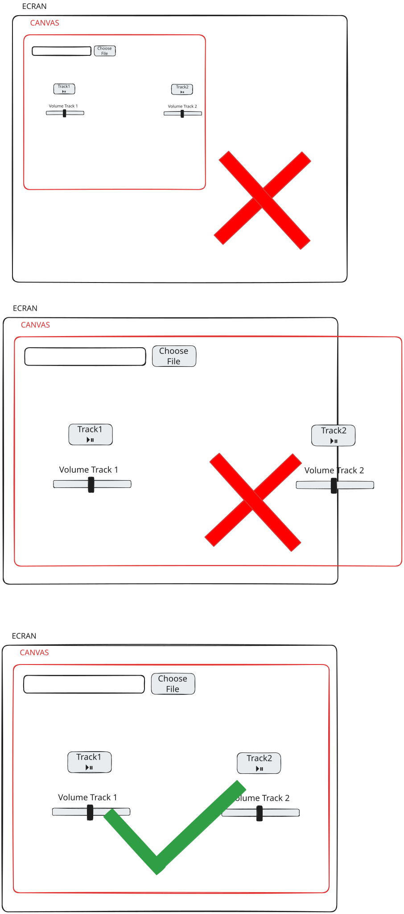

# Atelier : Table de Mixage DJ - Personnalisation

## Bienvenue !

Félicitations pour avoir terminé le DJ Mixing Deck Starter ! Maintenant, vous allez ajouter des fonctionnalités de personnalisation qui permettent aux utilisateurs de télécharger leurs propres sons et images de fond. Cela rend votre table de mixage DJ vraiment personnelle et unique !

---

## Ce que vous allez construire

À la fin de cet atelier, vous aurez :
- ✅ Une table de mixage DJ qui accepte les images de fond téléchargées
- ✅ Des boutons de téléchargement de fichiers pour chaque piste
- ✅ La capacité de remplacer les sons par vos propres fichiers audio
- ✅ Une expérience de mixage DJ entièrement personnalisable
- ✅ **Design adapté au mobile** qui fonctionne sur les téléphones et tablettes
- ✅ **Support tactile** pour les appareils mobiles
- ✅ **Mise en page responsive** qui s'adapte à toute taille d'écran

---

## Étape 1 : Comprendre les téléchargements de fichiers

### Qu'est-ce qu'un téléchargement de fichier ?

Les téléchargements de fichiers permettent aux utilisateurs de sélectionner des fichiers depuis leur ordinateur et de les utiliser dans votre programme. Pensez-y comme choisir une photo à télécharger sur les réseaux sociaux - vous cliquez sur un bouton, sélectionnez un fichier, et il devient partie de l'application.

### Comment fonctionnent les téléchargements de fichiers dans p5.js

Dans p5.js, vous utilisez `createFileInput()` pour créer un bouton de téléchargement de fichier. Quand un utilisateur sélectionne un fichier, p5.js vous donne des informations sur ce fichier, et vous pouvez l'utiliser dans votre programme.

**Le processus** :
1. Créez un bouton de saisie de fichier
2. L'utilisateur clique et sélectionne un fichier
3. Votre programme reçoit les informations du fichier
4. Vous chargez et utilisez le fichier (image ou son)

**Concept visuel** : 

**Documentation** : [`createFileInput()`](https://p5js.org/reference/p5/createFileInput) crée un bouton de téléchargement de fichier.

---

## Étape 2 : Ajouter le téléchargement d'image de fond

### Comprendre les téléchargements d'images

Vous voulez que les utilisateurs puissent télécharger leur propre image de fond. Cela remplace le fond blanc par l'image qu'ils ont choisie.

**La logique** :
1. Créez un bouton de saisie de fichier pour les images
2. Positionnez-le à l'écran
3. Quand un fichier est sélectionné, vérifiez si c'est une image
4. Chargez l'image et stockez-la dans une variable
5. Affichez-la comme fond dans `draw()`

### Étape 2A : Créer une variable pour l'image de fond

**Le concept** : Vous avez besoin d'un endroit pour stocker l'image téléchargée.

**Votre tâche** : En haut de votre code (avant les objets track), créez une variable :
- `let bgImage = null;`

**Pourquoi `null` ?** Cela signifie "pas d'image encore" - nous la définirons quand un utilisateur télécharge une image.

### Étape 2B : Créer le bouton de saisie de fichier

**La logique** : Créez une fonction helper pour configurer tous les file inputs, en gardant le code organisé.

**Votre tâche** : Créez une fonction appelée `setupFileInputs()` qui :
1. Crée des file inputs pour la piste 1, l'image de fond et la piste 2
2. Les positionne à l'écran
3. Définit l'attribut accept pour chacun

Puis dans `setup()`, appelez `setupFileInputs()` après avoir créé le canvas.

**Comprendre le code** :
- `createFileInput()` crée le bouton
- Le nom de fonction `handleBackgroundImage` est ce qui s'exécute quand un fichier est sélectionné
- `position()` le place à l'écran
- `attribute('accept', 'image/*')` restreint la sélection de fichiers aux images uniquement

**Documentation** :
- [`createFileInput()`](https://p5js.org/reference/p5/createFileInput)
- [`.position()`](https://p5js.org/reference/p5.Element/position)
- [`.attribute()`](https://p5js.org/reference/p5.Element/attribute)

### Étape 2C : Créer la fonction de gestion

**La logique** : Quand un utilisateur sélectionne un fichier image, vous avez besoin d'une fonction pour le gérer.

**Votre tâche** : Créez une fonction appelée `handleBackgroundImage()` qui :
1. Prend un paramètre file
2. Charge l'image : `bgImage = loadImage(file.data)`

**Note** : La vérification du type de fichier est gérée par l'attribut `accept`, donc la fonction de gestion est simplifiée.

**Comprendre le code** :
- `file.type` vous indique quel type de fichier c'est
- `file.data` contient les données du fichier que p5.js peut utiliser
- `loadImage()` charge une image depuis les données du fichier

**Documentation** : [`loadImage()`](https://p5js.org/reference/p5/loadImage) charge les fichiers image.

**Testez !** Essayez de télécharger une image - vous devriez voir le bouton de saisie de fichier, mais l'image ne s'affichera pas encore (nous l'ajouterons ensuite).

### Étape 2D : Afficher l'image de fond

**La logique** : Créez une fonction helper pour dessiner le fond, en gardant `draw()` organisé.

**Votre tâche** : Créez une fonction appelée `drawBackground()` qui :
1. Vérifie si `bgImage` existe (n'est pas null)
2. Si oui, la dessine : `image(bgImage, 0, 0, width, height)`
3. Si non, utilise le fond blanc normal : `background(255)`

Puis dans votre fonction `draw()`, appelez `drawBackground()` au début.

**Comprendre le code** :
- `if (bgImage)` vérifie si une image a été téléchargée
- `image()` dessine l'image pour remplir tout le canvas
- `width` et `height` la font remplir la taille du canvas

**Documentation** : [`image()`](https://p5js.org/reference/p5/image) dessine les images.

**Testez !** Téléchargez une image - elle devrait maintenant apparaître comme fond !

---

## Étape 3 : Ajouter le téléchargement de son pour la piste 1

### Comprendre les téléchargements de sons

Maintenant, vous voulez que les utilisateurs téléchargent leurs propres sons pour chaque piste. C'est similaire aux téléchargements d'images, mais pour les fichiers audio.

**La logique** :
1. Ajoutez une propriété file input à l'objet track
2. Créez un bouton de saisie de fichier dans `setup()`
3. Quand un fichier est sélectionné, gérez-le
4. Chargez le son et remplacez celui existant

### Étape 3A : Ajouter la propriété File Input aux objets Track

**Le concept** : Chaque piste doit stocker son bouton de saisie de fichier.

**Votre tâche** : Dans les objets `track1` et `track2`, ajoutez :
- `fileInput: null`

**Pourquoi ?** Cela stocke le bouton de saisie de fichier, comme nous stockons le slider et le bouton.

### Étape 3B : Créer le bouton de saisie de fichier pour la piste 1

**La logique** : Le file input pour la piste 1 est créé dans la fonction `setupFileInputs()` (de l'étape 2B).

**Votre tâche** : Le file input de la piste 1 est déjà inclus dans `setupFileInputs()`. Cela garde toute la création de file inputs au même endroit, rendant le code plus organisé.

**Comprendre le code** :
- `createFileInput()` avec une fonction qui appelle `handleSoundUpload()`
- Nous passons à la fois le fichier et l'objet track au gestionnaire
- `position()` le place sous le bouton de téléchargement de fond

**Testez !** Vous devriez voir un deuxième bouton de saisie de fichier, mais il ne fonctionnera pas encore (nous ajouterons le gestionnaire ensuite).

### Étape 3C : Créer le gestionnaire de téléchargement de son

**La logique** : Quand un utilisateur sélectionne un fichier audio, vous devez le charger et remplacer le son existant. Le code est organisé en petites fonctions helper.

**Votre tâche** : Créez une fonction appelée `handleSoundUpload()` qui :
1. Prend deux paramètres : `file` et `track`
2. Arrête la piste actuelle en utilisant `stopTrack(track)`
3. Charge le nouveau son : `track.sound = loadSound(file.data)`
4. Définit le volume : `track.sound.setVolume(track.volume)`
5. Réinitialise le time slider
6. Connecte l'analyseur d'amplitude après un court délai

Créez aussi les fonctions helper :
- `stopTrack(track)` - arrête une piste et réinitialise son bouton
- `connectAmplitudeAnalyzer(track)` - connecte l'analyseur d'amplitude au son

**Comprendre le code** :
- `file.type === 'audio'` vérifie si c'est un fichier audio
- `track.sound.stop()` arrête le son actuel s'il est en lecture
- `loadSound(file.data)` charge le nouveau son depuis le fichier
- Nous définissons le volume pour qu'il soit prêt à jouer

**Documentation** : [`loadSound()`](https://p5js.org/reference/p5.sound/p5.SoundFile) charge les fichiers son.

**Testez !** Téléchargez un fichier audio pour la piste 1 - il devrait remplacer le son par défaut !

---

## Étape 4 : Ajouter le téléchargement de son pour la piste 2

### Répéter le processus

**La logique** : Le file input de la piste 2 est déjà créé dans la fonction `setupFileInputs()`.

**Votre tâche** : Le file input de la piste 2 est déjà inclus dans `setupFileInputs()`. La même fonction `handleSoundUpload()` fonctionne pour les deux pistes car nous passons l'objet track comme paramètre. C'est la réutilisation de code !

**Pourquoi les fonctions helper ?** Diviser le code en petites fonctions le rend :
- Plus facile à comprendre
- Plus facile à tester
- Plus facile à maintenir
- Moins répétitif

**Testez !** Téléchargez des fichiers audio pour les deux pistes - ils devraient tous les deux fonctionner !

---

## Étape 5 : Améliorer l'expérience utilisateur

### Ajouter des labels

**La logique** : Les utilisateurs doivent savoir ce que fait chaque bouton de saisie de fichier.

**Votre tâche** : Dans votre fonction `draw()`, ajoutez des labels de texte au-dessus de chaque file input :
- "choose track 1" à la position (width * 0.15, height * 0.12)
- "change background" à la position (width/2, height * 0.12)
- "choose track 2" à la position (width * 0.85, height * 0.12)

**Comprendre le code** :
- Utilisez `textAlign(CENTER)` pour centrer le texte
- Positionnez les labels juste au-dessus de chaque bouton de saisie de fichier
- Utilisez `fill(0)` pour le texte noir

**Testez !** Les labels devraient rendre clair ce que fait chaque bouton !

### Gérer les cas limites

**La logique** : Votre code devrait gérer les situations où les choses pourraient mal tourner.

**Votre tâche** : Assurez-vous que votre code vérifie :
- Dans `toggleTrack()` : Vérifiez si `track.sound` existe avant d'essayer de le jouer
- Dans `draw()` : Vérifiez si les sons existent avant de vérifier s'ils sont en lecture

**Pourquoi ?** Si un utilisateur n'a pas encore téléchargé un son, ou s'il y a une erreur, votre programme ne devrait pas planter.

**Testez !** Essayez de cliquer sur les boutons play avant de télécharger des sons - le programme devrait le gérer gracieusement !

---

## Étape 6 : Tout mettre ensemble

### Tests finaux

**Votre tâche** : Testez toutes les fonctionnalités :
1. ✅ Téléchargez une image de fond - s'affiche-t-elle ?
2. ✅ Téléchargez un son pour la piste 1 - remplace-t-il le défaut ?
3. ✅ Téléchargez un son pour la piste 2 - remplace-t-il le défaut ?
4. ✅ Jouez les deux pistes - fonctionnent-elles avec les sons téléchargés ?
5. ✅ Ajustez les volumes - les sliders fonctionnent-ils toujours ?
6. ✅ Mélangez les pistes - pouvez-vous jouer les deux en même temps ?

### Idées de personnalisation

Maintenant que vous avez les téléchargements de fichiers qui fonctionnent, essayez :
- Téléchargez différentes images de fond
- Téléchargez vos chansons préférées
- Mélangez différents genres de musique
- Créez des tables de mixage DJ thématiques (par exemple, toute la musique électronique avec un fond néon)

---

## Étape 7 : Rendre compatible mobile

### Comprendre le support mobile

Votre table de mixage DJ devrait fonctionner sur les appareils mobiles ! Cela signifie :
- **Support tactile** : Les boutons et sliders fonctionnent avec le toucher, pas seulement les clics de souris
- **Design responsive** : La mise en page s'adapte à différentes tailles d'écran
- **Plein écran** : Utilise tout l'écran sur les appareils mobiles

### Étape 7A : Rendre le canvas responsive

**La logique** : Au lieu d'une taille de canvas fixe, utilisez la taille complète de la fenêtre pour que cela fonctionne sur n'importe quel appareil.

**Votre tâche** : Dans `setup()`, changez :
- De : `createCanvas(800, 600);`
- À : `createCanvas(windowWidth, windowHeight);`

**Comprendre le code** :
- `windowWidth` et `windowHeight` sont des variables p5.js qui vous donnent la taille de la fenêtre du navigateur
- Cela fait que votre canvas remplit tout l'écran sur n'importe quel appareil

**Documentation** : [`windowWidth`](https://p5js.org/reference/p5/windowWidth) et [`windowHeight`](https://p5js.org/reference/p5/windowHeight) vous donnent les dimensions de la fenêtre.

### Étape 7B : Rendre les positions responsive

**La logique** : Au lieu de positions codées en dur, calculez-les en fonction de la taille de l'écran.

**Votre tâche** : Créez une fonction appelée `updatePositions()` qui :
1. Calcule les positions en fonction de `width` et `height` (taille du canvas)
2. Utilise des pourcentages (comme `width * 0.3`) au lieu de pixels fixes
3. Met à jour les positions des deux pistes

**Exemple de logique** :
- Centre X : `width / 2`
- Bouton Y : `height * 0.3` (30% vers le bas de l'écran)
- Slider Y : `height * 0.6` (60% vers le bas de l'écran)
- Piste 1 : `centerX - width * 0.2` (à gauche du centre)
- Piste 2 : `centerX + width * 0.2` (à droite du centre)

**Concept visuel** : 

**Testez !** Redimensionnez la fenêtre de votre navigateur - les boutons et sliders devraient se déplacer pour rester aux bonnes positions !

### Étape 7C : Ajouter le support tactile

**La logique** : Les appareils mobiles utilisent le toucher, pas les clics de souris. Vous devez supporter les deux. Le support tactile est ajouté dans une fonction helper.

**Votre tâche** : Créez une fonction appelée `setupTrackButton(track)` qui :
1. Crée le bouton pour une piste
2. Le positionne
3. Ajoute à la fois les gestionnaires `mousePressed()` et `touchStarted()`

Puis dans `setup()`, appelez `setupTrackButton(track1)` et `setupTrackButton(track2)`. Cela garde le code organisé et évite la répétition !

**Comprendre le code** :
- `.touchStarted()` est comme `.mousePressed()` mais pour les écrans tactiles
- Cela fait fonctionner les boutons sur les appareils mobiles

**Documentation** : [`.touchStarted()`](https://p5js.org/reference/p5.Element/touchStarted) gère les événements tactiles.

**Testez !** Sur un appareil mobile, vous devriez pouvoir appuyer sur les boutons pour play/pause !

### Étape 7D : Gérer le redimensionnement de la fenêtre

**La logique** : Quand la taille de la fenêtre change (comme tourner un téléphone), vous devez mettre à jour les positions. Le code utilise des fonctions helper pour rester organisé.

**Votre tâche** : Créez une fonction appelée `windowResized()` qui :
1. Redimensionne le canvas : `resizeCanvas(windowWidth, windowHeight)`
2. Met à jour les positions : `updatePositions()`
3. Met à jour les positions des pistes en utilisant la fonction helper `updateTrackPositions(track)`
4. Met à jour les positions des file inputs

Créez aussi `updateTrackPositions(track)` qui met à jour les positions du bouton, du slider et du time slider pour n'importe quelle piste. Cela évite de répéter le code pour track1 et track2 !

**Comprendre le code** :
- `windowResized()` s'exécute automatiquement quand la taille de la fenêtre change
- Cela garde tout positionné correctement après rotation ou redimensionnement

**Documentation** : [`windowResized()`](https://p5js.org/reference/p5/windowResized) gère les événements de redimensionnement de fenêtre.

**Testez !** Tournez votre téléphone ou redimensionnez le navigateur - tout devrait rester à la bonne place !

---

## Étape 8 : Partager votre table de mixage DJ

### Partager sur l'éditeur web p5.js

**La logique** : Une fois que votre table de mixage DJ fonctionne, vous pouvez la partager avec d'autres !

**Votre tâche** :
1. Dans l'éditeur web p5.js, cliquez sur le bouton "Share"
2. Copiez le lien de partage
3. Envoyez-le à des amis ou publiez-le en ligne

**Pourquoi partager ?**
- Les amis peuvent utiliser votre table de mixage DJ
- Ils peuvent télécharger leurs propres sons et images
- Vous pouvez obtenir des commentaires et voir comment d'autres l'utilisent

### Tester sur mobile

**Votre tâche** :
1. Ouvrez le lien de partage sur votre téléphone ou tablette
2. Testez toutes les fonctionnalités :
   - ✅ Pouvez-vous appuyer sur les boutons ?
   - ✅ Pouvez-vous faire glisser les sliders ?
   - ✅ Pouvez-vous télécharger des images et des sons ?
   - ✅ Tout fonctionne-t-il quand vous tournez l'écran ?

**Pourquoi tester sur mobile ?**
- Les appareils mobiles sont la façon dont la plupart des gens accèdent au web
- Les interactions tactiles sont différentes des clics de souris
- Les tailles d'écran varient, donc vous devez vous assurer que cela fonctionne partout

### Partager avec des amis

**Votre tâche** :
1. Partagez votre lien de sketch p5.js avec un ami
2. Demandez-leur de :
   - L'ouvrir sur leur téléphone
   - Télécharger leurs propres sons et images
   - Créer leur propre table de mixage DJ personnalisée
   - Le partager avec vous !

**Pourquoi partager ?**
- Voyez comment d'autres personnalisent votre création
- Obtenez des idées d'améliorations
- Construisez une communauté autour de votre projet
- Amusez-vous à mélanger de la musique ensemble !

---

## Félicitations ! 🎉

Vous avez ajouté avec succès des fonctionnalités de personnalisation à votre table de mixage DJ ! Les utilisateurs peuvent maintenant :
- Télécharger leurs propres images de fond
- Télécharger leurs propres sons pour chaque piste
- Créer une expérience de mixage DJ vraiment personnalisée

**Ce que vous avez appris** :
- Comment fonctionnent les téléchargements de fichiers dans les applications web
- Comment créer des boutons de saisie de fichier dans p5.js
- Comment gérer les téléchargements de fichiers image et audio
- Comment remplacer les assets existants par des fichiers téléchargés par l'utilisateur
- Comment améliorer l'expérience utilisateur avec des labels et la gestion des erreurs
- Comment rendre votre sketch compatible mobile avec un design responsive
- Comment ajouter le support tactile pour les appareils mobiles
- Comment partager votre création avec d'autres

**Prochaines étapes** :
- Expérimentez avec différents types de fichiers
- Ajoutez plus d'options de personnalisation
- **Partagez votre lien de sketch p5.js avec des amis !**
- **Testez-le sur des appareils mobiles**
- **Encouragez les amis à créer leurs propres tables de mixage DJ personnalisées !**

---

## Dépannage

**Problème** : L'image ne s'affiche pas après le téléchargement
- **Solution** : Vérifiez que vous utilisez `image()` dans `draw()` et que vous vérifiez si `bgImage` existe

**Problème** : Le son ne joue pas après le téléchargement
- **Solution** : Assurez-vous que vous appelez `loadSound(file.data)` et que vous définissez le volume

**Problème** : Les boutons de saisie de fichier sont au mauvais endroit
- **Solution** : Ajustez les valeurs `position()` pour les déplacer où vous voulez

**Problème** : De mauvais types de fichiers peuvent être sélectionnés
- **Solution** : Vérifiez que vous utilisez `.attribute('accept', 'image/*')` ou `'audio/*'`

**Problème** : Les boutons ne fonctionnent pas sur mobile
- **Solution** : Assurez-vous que vous avez ajouté les gestionnaires `.touchStarted()` à vos boutons

**Problème** : La mise en page semble incorrecte sur mobile
- **Solution** : Vérifiez que vous utilisez `windowWidth` et `windowHeight`, et que `updatePositions()` calcule les positions en fonction de la taille de l'écran

**Problème** : Les éléments ne bougent pas quand l'écran tourne
- **Solution** : Assurez-vous que vous avez une fonction `windowResized()` qui met à jour les positions

**Rappelez-vous** : Si quelque chose ne fonctionne pas, vérifiez la console du navigateur pour les messages d'erreur !

