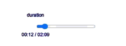
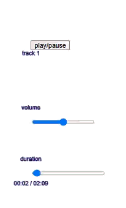
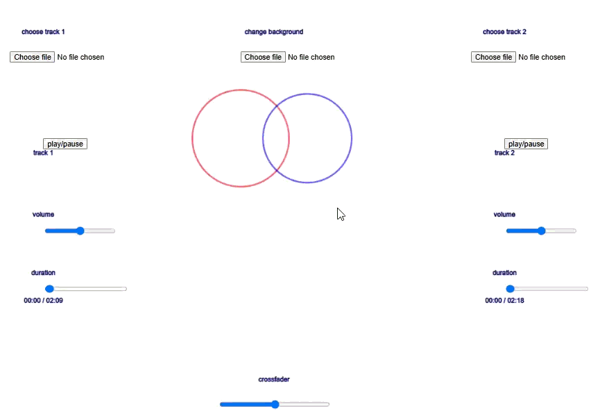
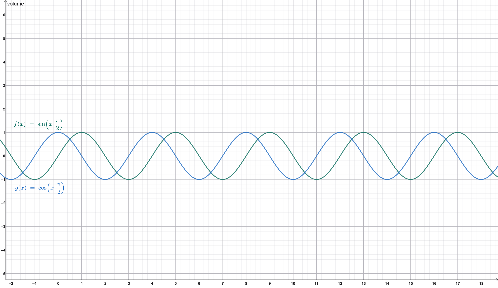
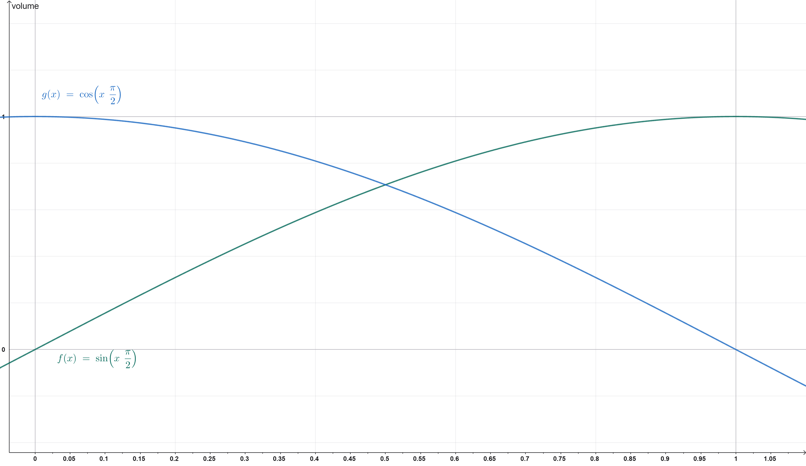

# Atelier : Table de Mixage DJ - Fonctionnalités Avancées

## Bienvenue !

Félicitations pour avoir terminé l'atelier de Personnalisation ! Maintenant, vous allez ajouter des fonctionnalités DJ avancées qui rendent votre table vraiment professionnelle : des sliders de temps pour naviguer dans les pistes, un crossfader pour des transitions fluides, et une visualisation BPM pour voir le rythme !

---

## Prérequis

**Avant de commencer cet atelier, assurez-vous d'avoir terminé la Partie 2 : Personnalisation**, qui inclut :
- ✅ Téléchargements de fichiers pour les images de fond et les sons
- ✅ Design responsive adapté au mobile
- ✅ Support tactile
- ✅ Fonctions helper pour un code organisé

---

## Ce que vous allez construire

À la fin de cet atelier, vous ajouterez :
- ✅ **Sliders de temps** - Sauter à n'importe quelle position dans une piste
- ✅ **Affichage du temps** - Voir le temps écoulé et la durée totale (format MM:SS)
- ✅ **Crossfader** - Transitionner en douceur entre les pistes en utilisant la trigonométrie
- ✅ **Visualisation BPM** - Cercles pulsants qui réagissent au rythme
- ✅ **Code refactorisé** - Apprendre à organiser le code en petites fonctions réutilisables

---

## Étape 1 : Ajouter les sliders de temps

### Comprendre les sliders de temps

Les sliders de temps permettent aux DJs de sauter à n'importe quelle position dans une piste. Pensez-y comme à la barre de progression d'un lecteur vidéo - vous pouvez cliquer n'importe où pour sauter à ce point dans la chanson.

**La logique** :
1. Ajoutez une propriété time slider à chaque objet track
2. Créez le slider dans `setupTrackSliders()`
3. Mettez à jour la position du slider pendant que la piste joue
4. Quand le slider est déplacé, sautez à cette position dans la piste

### Étape 1A : Ajouter les propriétés Time Slider

**Ce que vous devez faire** : Dans les objets `track1` et `track2`, ajoutez des propriétés pour le slider de temps. Réfléchissez à :
1. Qu'est-ce que vous devez stocker ? (L'élément slider, sa position, et si l'utilisateur le fait glisser)
2. Quelles devraient être les valeurs initiales ? (Nous n'avons pas encore créé le slider, donc que devrions-nous utiliser ?)

**Pourquoi ?** Ces propriétés stockent l'élément slider, sa position, et si l'utilisateur le fait glisser. Tout comme le slider de volume, nous devons garder une trace de toutes les informations sur le slider de temps.

### Étape 1B : Créer les sliders de temps

**Ce que vous devez faire** : Mettez à jour votre fonction `setupTrackSliders()` pour créer aussi un slider de temps. Réfléchissez à :
1. Quelle plage le slider devrait-il avoir ? (0-100 pour représenter 0%-100% à travers la piste)
2. Que devrait-il se passer quand le slider est déplacé ? (Sauter à cette position dans la piste)
3. Comment calculez-vous quel temps dans la piste correspond à la valeur du slider ?

**Comprendre le code** :
- `createSlider(0, 100, 0)` crée un slider de 0% à 100%, commençant à 0%
- `.input()` s'exécute quand le slider est déplacé
- `track.sound.duration()` obtient la longueur totale du son
- `track.sound.jump(targetTime)` saute à un temps spécifique dans le son

**Documentation** :
- [`sound.duration()`](https://p5js.org/reference/p5.SoundFile/duration) obtient la durée totale
- [`sound.jump()`](https://p5js.org/reference/p5.SoundFile/jump) saute à un temps spécifique
- [`sound.currentTime()`](https://p5js.org/reference/p5.SoundFile/currentTime) obtient le temps de lecture actuel

**Concept visuel** : 

### Étape 1C : Mettre à jour les positions des sliders de temps

**Votre tâche** : Mettez à jour votre fonction `updatePositions()` pour calculer les positions des sliders de temps. Réfléchissez à :
1. Où les sliders de temps devraient-ils être positionnés ? (En dessous des sliders de volume)
2. Comment calculez-vous la position Y ? (Utilisez un pourcentage de la hauteur, comme `height * 0.55`)
3. Comment mettez-vous à jour les positions des sliders de temps pour track1 et track2 ?

### Étape 1D : Mettre à jour les sliders de temps pendant la lecture

**Ce que vous devez faire** : Créez une fonction pour mettre à jour les sliders de temps pendant que les pistes jouent. Réfléchissez à :
1. Comment savez-vous jusqu'où vous êtes dans la piste ? (Temps actuel vs durée totale)
2. Comment convertissez-vous cela en valeur de slider ? (Pourcentage : 0-100)
3. Quand cette mise à jour devrait-elle se produire ? (En continu, dans la boucle draw)

Créez une fonction `updateTimeSliders()` qui met à jour les sliders de temps pour les deux pistes, et une fonction helper `updateTimeSlider(track)` qui :
- Obtient le temps actuel dans la piste
- Obtient la durée totale du son
- Calcule le progrès en pourcentage (0-100)
- Met à jour la valeur du slider pour montrer la position actuelle

Puis appelez `updateTimeSliders()` dans votre fonction `draw()`.

**Comprendre le code** :
- `currentTime()` obtient jusqu'où nous sommes dans la piste
- Nous calculons le progrès en pourcentage (0-100)
- Mettez à jour la valeur du slider pour montrer la position actuelle

**Concept visuel** : 

**Testez !** Jouez une piste et regardez le slider de temps bouger. Essayez de le faire glisser pour sauter à différentes positions !

---

## Étape 2 : Afficher le temps au format MM:SS

### Comprendre le formatage du temps

Au lieu d'afficher les secondes brutes, nous afficherons le temps au format "MM:SS" (minutes:secondes), comme "02:35" pour 2 minutes et 35 secondes.

### Étape 2A : Créer une fonction de formatage du temps

**Ce que vous devez faire** : Créez une fonction pour formater les secondes en format MM:SS. Réfléchissez à :
1. Comment convertissez-vous les secondes totales en minutes et secondes ?
2. Comment assurez-vous que chaque nombre a toujours 2 chiffres ? (par exemple, "05" au lieu de "5")
3. Comment combinez-vous les minutes et secondes avec deux-points ?

**Comprendre le code** :
- `Math.floor(seconds / 60)` obtient les minutes (nombre entier)
- `Math.floor(seconds % 60)` obtient les secondes restantes
- `String().padStart(2, '0')` assure 2 chiffres (par exemple, "05" au lieu de "5")
- Retourne le format comme "02:35"

**Documentation** : [`String.padStart()`](https://developer.mozilla.org/en-US/docs/Web/JavaScript/Reference/Global_Objects/String/padStart) remplit les chaînes.

### Étape 2B : Afficher le temps

**Votre tâche** : Créez une fonction pour afficher le temps pour chaque piste. Réfléchissez à :
1. Comment obtenez-vous le temps écoulé et la durée totale ?
2. Comment les formatez-vous en utilisant la fonction `formatTime()` ?
3. Comment les combinez-vous avec " / " entre eux ?
4. Où le texte devrait-il être affiché ? (En dessous du slider de temps)

Puis appelez `drawTimeDisplay(track1)` et `drawTimeDisplay(track2)` dans votre fonction `draw()`.

**Testez !** Vous devriez voir le temps affiché comme "00:15 / 03:42" (écoulé / total) !

---

## Étape 3 : Ajouter un crossfader

### Comprendre les crossfaders

Un crossfader transitionne en douceur entre deux pistes. À 0%, seule la piste 1 est entendue. À 100%, seule la piste 2 est entendue. À 50%, les deux pistes jouent à leurs niveaux de volume respectifs.

**Exemple du monde réel** : Les DJs utilisent des crossfaders pour transitionner en douceur d'une chanson à une autre pendant un mix.

### Étape 3A : Ajouter les variables Crossfader

**Ce que vous devez faire** : En haut de votre code, ajoutez des variables pour le crossfader. Réfléchissez à :
1. Qu'est-ce que vous devez stocker ? (L'élément slider, et sa valeur actuelle)
2. Quelle devrait être la valeur initiale ? (50% signifie que les deux pistes sont entendues également)

### Étape 3B : Créer le slider Crossfader

**Votre tâche** : Créez une fonction pour configurer le crossfader. Réfléchissez à :
1. Quelle plage le slider devrait-il avoir ? (0-100, commençant à 50)
2. Où devrait-il être positionné ? (Centre de l'écran)
3. Quelle largeur devrait-il avoir ? (par exemple, 200px)

Puis appelez `setupCrossfader()` dans votre fonction `setup()`.

### Étape 3C : Implémenter la logique du crossfader avec la trigonométrie

**La logique** : Nous utiliserons les fonctions `sin()` et `cos()` pour des courbes de crossfade fluides.

**Ce que vous devez faire** : Créez une fonction pour appliquer le crossfader. Réfléchissez à :
1. Comment convertissez-vous la valeur du slider (0-100) en angle ? (Mapper à 0 à π/2)
2. Comment `cos()` se comporte-t-il ? (1.0 à 0°, 0.0 à 90° - parfait pour que track1 s'estompe)
3. Comment `sin()` se comporte-t-il ? (0.0 à 0°, 1.0 à 90° - parfait pour que track2 s'intensifie)
4. Comment combinez-vous cela avec le réglage de volume individuel de chaque piste ?

Puis appelez `applyCrossfader()` dans votre fonction `draw()`.

**Comprendre le code** :
- Mappez la valeur du crossfader (0-100) à un angle (0 à π/2)
- `cos(angle)` donne le volume de track1 : 1.0 à 0°, 0.0 à 90°
- `sin(angle)` donne le volume de track2 : 0.0 à 0°, 1.0 à 90°
- Multipliez par le volume de la piste pour respecter les réglages de volume individuels

**Pourquoi la trigonométrie ?** Elle crée des transitions fluides et naturelles au lieu de changements brusques !

**Concept visuel** : 




**Documentation** :
- [`cos()`](https://p5js.org/reference/p5/cos) et [`sin()`](https://p5js.org/reference/p5/sin) pour des courbes fluides

**Testez !** Déplacez le crossfader - la piste 1 devrait s'estomper pendant que la piste 2 s'intensifie !

---

## Étape 4 : Ajouter la visualisation BPM

### Comprendre la visualisation BPM

La visualisation BPM (Beats Per Minute) montre le rythme de la musique à travers des cercles pulsants. Les cercles deviennent plus grands quand le rythme est plus fort.

**La logique** :
1. Utilisez `p5.Amplitude` pour analyser l'audio
2. Obtenez le niveau d'amplitude (à quel point le son est fort)
3. Faites pulser les cercles en fonction de l'amplitude
4. Affichez les cercles au centre de l'écran

### Étape 4A : Configurer les analyseurs d'amplitude

**Ce que vous devez faire** : Dans votre fonction `setup()`, créez des analyseurs d'amplitude. Réfléchissez à :
1. Qu'est-ce qu'un analyseur d'amplitude fait ? (Mesure à quel point l'audio est fort)
2. Combien d'analyseurs avez-vous besoin ? (Un pour chaque piste)
3. Comment les connectez-vous aux sons ? (Pour qu'ils puissent analyser l'audio)

**Documentation** : [`p5.Amplitude`](https://p5js.org/reference/p5.Amplitude) analyse l'amplitude audio.

### Étape 4B : Ajouter les propriétés de taille de pulsation

**Ce que vous devez faire** : Dans les deux objets track, ajoutez une propriété pour stocker la taille de pulsation. Réfléchissez à :
1. Que représente cette propriété ? (La taille actuelle du cercle pulsant)
2. Quelle devrait être la valeur initiale ? (Une taille de base qui grandira quand le rythme est fort)

### Étape 4C : Créer les fonctions de visualisation BPM

**Ce que vous devez faire** : Créez des fonctions pour dessiner la visualisation BPM. Réfléchissez à :
1. Comment obtenez-vous le niveau d'amplitude ? (Depuis l'analyseur d'amplitude)
2. Comment convertissez-vous l'amplitude en taille de cercle ? (Amplitude plus grande = cercle plus grand)
3. Où les cercles devraient-ils être affichés ? (Centre de l'écran, côte à côte)
4. Comment dessinez-vous un cercle qui pulse ? (Mettez à jour la taille en fonction de l'amplitude à chaque image)

Créez une fonction `drawBPMVisualization()` qui :
- Calcule la taille de pulsation pour chaque piste
- Détermine où afficher les cercles (centre de l'écran, côte à côte)
- Dessine les cercles pulsants pour chaque piste

Créez des fonctions helper :
- `getPulseSize(track, amp)` - obtient le niveau d'amplitude et calcule la taille du cercle (taille minimum + amplification basée sur l'amplitude)
- `drawBeatCircle(x, y, size, color, label)` - dessine un cercle à la position et taille spécifiées, ajoute un label en dessous

Puis appelez `drawBPMVisualization()` dans votre fonction `draw()`.

**Comprendre le code** :
- `amp.getLevel()` obtient l'amplitude actuelle (0.0 à 1.0)
- `Math.max(80, 80 + (level * 400))` assure une taille minimum de 80, s'agrandit avec l'amplitude
- Les cercles pulsent en synchronisation avec le rythme !

**Important** : L'amplitude est lue depuis l'audio brut, donc elle montre le BPM même si le volume ou le crossfader est à 0% !

**Concept visuel** : 

**Testez !** Jouez des pistes et regardez les cercles pulser avec le rythme !

---

## Étape 5 : Mettre à jour les labels et la mise en page

### Étape 5A : Ajouter les labels de durée

**Votre tâche** : Dans votre fonction `drawLabels()`, ajoutez des labels pour les sliders de temps. Réfléchissez à :
1. Quel texte les labels devraient-ils dire ? ("duration")
2. Où devraient-ils être positionnés ? (Juste au-dessus de chaque slider de temps)

### Étape 5B : Ajouter le label Crossfader

**Votre tâche** : Ajoutez un label pour le crossfader. Réfléchissez à :
1. Quel texte devrait-il dire ? ("crossfader")
2. Où devrait-il être positionné ? (Au-dessus du slider crossfader)

### Étape 5C : Mettre à jour la mise en page

**Votre tâche** : Assurez-vous que votre fonction `updatePositions()` calcule les positions pour la nouvelle mise en page :

```
+-------------------------------------------------------+
| choose track 1  | change background  | choose track 2 |
+-----------------+--------------------+----------------+
|  play/pause     | beat   | beat      | play/pause     |
|  track 1        | visual | visual    | track 2        |
|                 |   1    |   2       |                |
| volume slider1  |        |           | volume slider 2|
|                 |        |           |                |
| duration slider1|        |           |duration slider2|
|                 |        |           |                |
+-------------------------------------------------------+
|                                                       |
|                  crossfader slider                    |
+-------------------------------------------------------+
```

---

## Étape 6 : Refactoriser l'organisation du code

### Comprendre l'organisation du code

Le code a été refactorisé en petites fonctions ciblées. Cela le rend :
- Plus facile à comprendre
- Plus facile à tester
- Plus facile à maintenir
- Moins répétitif

### Fonctions helper clés

**Fonctions de setup** :
- `setupFileInputs()` - Crée tous les file inputs
- `setupTrackButton(track)` - Crée le bouton pour une piste
- `setupTrackSliders(track)` - Crée les sliders pour une piste
- `setupCrossfader()` - Crée le crossfader

**Fonctions de draw** :
- `drawBackground()` - Dessine le fond
- `drawLabels()` - Dessine tous les labels
- `drawTimeDisplay(track)` - Affiche le temps pour une piste
- `drawBPMVisualization()` - Dessine les cercles pulsants

**Fonctions de mise à jour** :
- `updateVolumes()` - Met à jour les volumes depuis les sliders
- `updateTimeSliders()` - Met à jour les positions des sliders de temps
- `applyCrossfader()` - Applique la logique du crossfader

**Fonctions de contrôle de piste** :
- `pauseTrack(track)` - Met en pause une piste
- `playTrack(track)` - Joue une piste
- `stopTrack(track)` - Arrête une piste
- `connectAmplitudeAnalyzer(track)` - Connecte l'analyseur

**Pourquoi refactoriser ?** Les petites fonctions sont plus faciles à comprendre, tester et modifier !

---

## Étape 7 : Tests finaux

### Liste de contrôle des tests

Testez toutes les nouvelles fonctionnalités :

1. ✅ **Sliders de temps**
   - Montrent-ils la position actuelle ?
   - Pouvez-vous les faire glisser pour sauter dans la piste ?
   - L'affichage du temps se met-il à jour correctement ?

2. ✅ **Affichage du temps**
   - Le temps est-il affiché au format MM:SS ?
   - Affiche-t-il "écoulé / total" correctement ?

3. ✅ **Crossfader**
   - À 0%, seule la piste 1 est-elle entendue ?
   - À 100%, seule la piste 2 est-elle entendue ?
   - À 50%, les deux pistes sont-elles entendues ?
   - La transition est-elle fluide ?

4. ✅ **Visualisation BPM**
   - Les cercles pulsent-ils avec le rythme ?
   - Fonctionnent-ils même quand le volume est à 0% ?
   - Fonctionnent-ils même quand le crossfader est à 0% ?

5. ✅ **Organisation du code**
   - Le code est-il organisé en petites fonctions ?
   - Est-il facile à comprendre ?
   - Pouvez-vous trouver des fonctionnalités spécifiques rapidement ?

---

## Félicitations ! 🎉

Vous avez ajouté avec succès des fonctionnalités DJ avancées ! Votre table a maintenant :
- Des sliders de temps pour naviguer dans les pistes
- Un affichage du temps au format MM:SS
- Un crossfader pour des transitions fluides
- Une visualisation BPM avec des cercles pulsants
- Un code bien organisé et refactorisé

**Ce que vous avez appris** :
- Comment créer des sliders de temps et sauter à des positions dans l'audio
- Comment formater et afficher le temps
- Comment utiliser la trigonométrie pour un crossfade fluide
- Comment analyser l'amplitude audio pour la visualisation
- Comment organiser le code en petites fonctions réutilisables

**Prochaines étapes** :
- Expérimentez avec différentes courbes de crossfader
- Essayez différents styles de visualisation BPM
- Ajoutez plus de fonctionnalités avancées (EQ, effets, etc.)
- Partagez votre table de mixage DJ professionnelle !

---

## Dépannage

**Problème** : Le slider de temps ne se met pas à jour
- **Solution** : Assurez-vous que `updateTimeSliders()` est appelé dans `draw()`

**Problème** : Impossible de sauter à une position dans la piste
- **Solution** : Vérifiez que `track.sound.jump(targetTime)` est appelé dans le gestionnaire `.input()` du slider

**Problème** : Le crossfader ne fonctionne pas en douceur
- **Solution** : Assurez-vous que vous utilisez `cos()` et `sin()` avec le calcul d'angle

**Problème** : La visualisation BPM ne s'affiche pas
- **Solution** : Vérifiez que `amp1.setInput(track1.sound)` et `amp2.setInput(track2.sound)` sont appelés

**Problème** : Les cercles ne pulsent pas
- **Solution** : Assurez-vous que `drawBPMVisualization()` est appelé dans `draw()` et que les analyseurs d'amplitude sont connectés

**Rappelez-vous** : Vérifiez toujours la console du navigateur (F12) pour les messages d'erreur !

